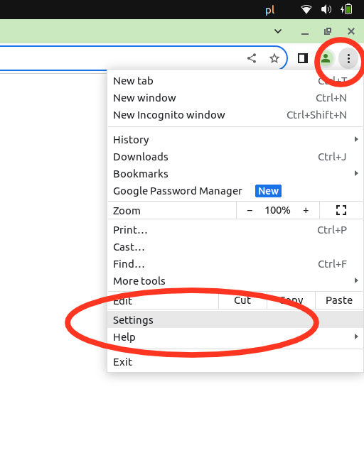
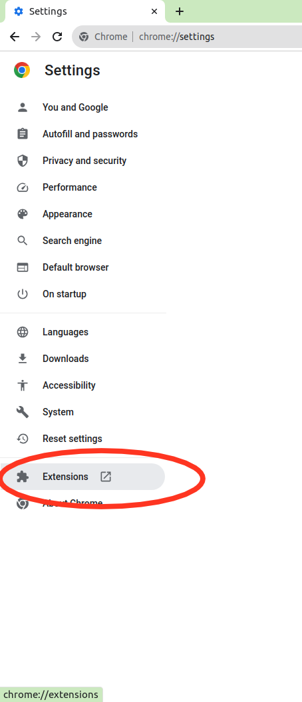
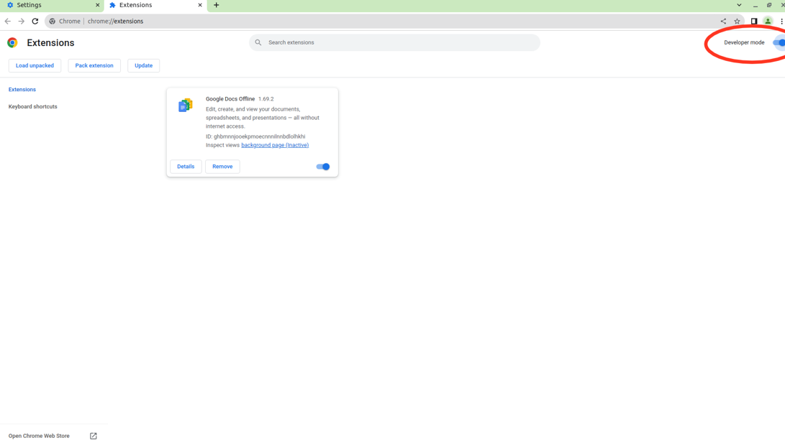
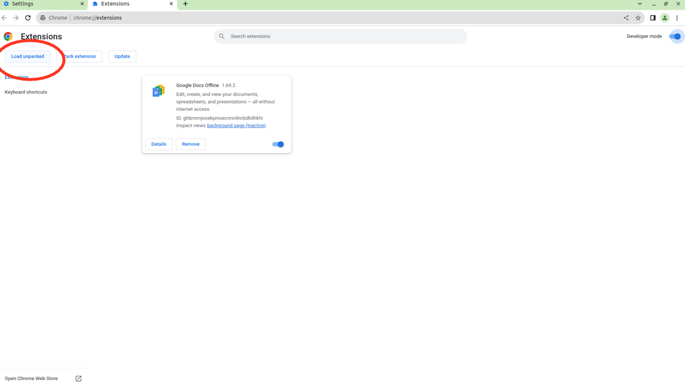
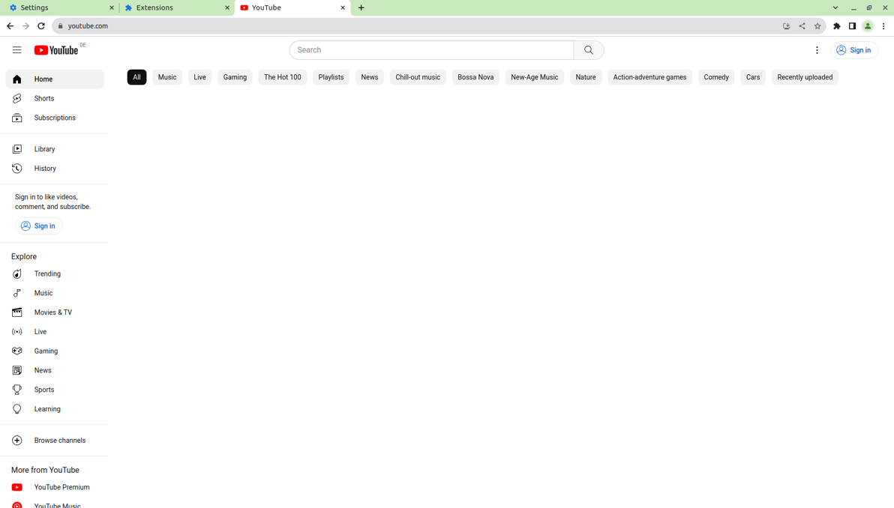

# Feed Remover
Do you find yourself endlessly scrolling through Facebook and YouTube feeds? I have a solution for you. Create your own browser extension in just 5 easy steps.

With this approach:

- You can easily remove any unwanted elements from any webpage.
- You won't grant external extensions unlimited access to your browsing data.
- It takes only five minutes to set up

## Why?
I wanted to eliminate the intrusive feeds on YouTube and Facebook. However, I was reluctant to install third-party extensions, as many require broad permissions that grant them access to all the websites I visit. It took me five minutes to setup, so you should be done in six.

# How to setup?

Not into `git`? You can download it directly [here](https://github.com/kwkr/feed-remover/archive/refs/heads/master.zip)

## Step 1
After downloading the repo somewhere to your computer, open your browser and navigate to the settings. This guide is compatible with Brave, Chrome, and any browser that supports Chrome extensions.

## Step 2
Access the extensions tab. (You can also directly go to the following url [Extensions](chrome://extensions))

## Step 3
Enable 'Developer Mode'. Once activated, new options will appear on the left, including "Load unpacked".

## Step 4
Click on "Load unpacked" and select the folder containing the code from this repository.

## Step 5
Go to [YouTube](https://youtube.com) or [Facebook](https://facebook.com) and enjoy feedless view.

# Configuration
If you'd like to customize the functionality, you can modify the content.js script and manifest.json directly. Remember to reload the extension after making any changes. This can be done from the [Extensions](chrome://extensions) page.